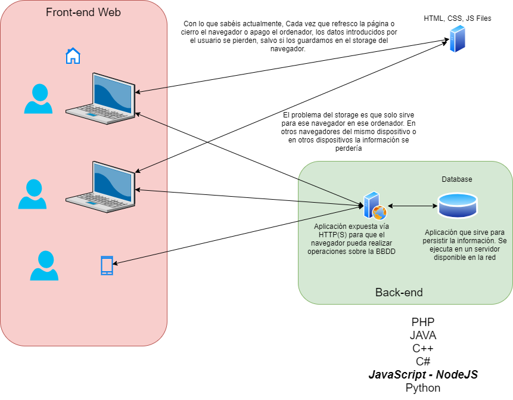

# Introduction

Para poder desarrollar backends en el lenguaje de programación JavaScript, existe una plataforma llamada NodeJS.

## Características de NodeJS

- **Plataforma para gestionar la I/O** de un sistema operativo (ordenador/servidor).
    ** la I/O es la entrada y salida de datos (Input/Output).
        - Ficheros
        - Recoger lo que un usuario escribe en el teclado
        - Recibir y enviar peticiones externas utilizando protocolos de red (HTTP, SMTP, SSH, etc...).

- **Orientado a eventos**: Es un único hilo (Main-Thread) que permite subscribirse a acciones asíncronas (que no bloquean el hilo principal) que llamos eventos.

- **Multiplataforma**: Al igual que Java, se puede desarrollar con NodeJS y que ese mismo programa se ejecute en cualquier sistema operativo, sin tener que desarrollar un código especial para cada SO.

- **Modular**: NodeJS está divido en diferentes módulos (Igual que JS) que puedo exportar al crearlos e importar para utilizarlos. Además viene con varios módulos ya preinstalados (http, fs).

- **Rápido y Eficiente**: Como solo tiene un hilo, consume muy pocos recursos.
    ** EJ aprox: Para 1000 usuarios concurrentes, un proceso NodeJS consumiría 5MB de RAM.

    ** Ej Real: Linkedn al cambiar su backend a NodeJS, por sus características de negocio, pudo reducir su backend de 30 servidores a 3.

- **Full Access al SO del servidor en el que se ejecuta**
