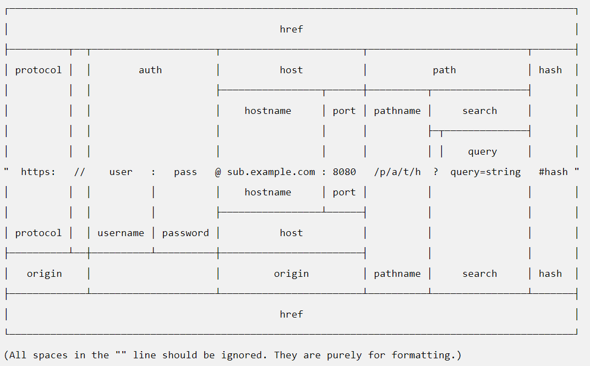

# HTTP y URL

El módulo HTTP del core de nodejs nos proporciona utilidades para cralquier cosa que queramos hacer con el protocolo HTTP. Existen dos módulos `http`y el `https`.

Las principales funcionalidades que podemos hacer con el módulo http(s) son:

- Realizar peticiones HTTP desde nuestra aplicación NodeJS a otros servidores.
- Crear servidores de aplicación sobre HTTP en la máquina que ejecutemos el programa.

Como el protocolo http tiene un componente muy importante sobre las url's, NodeJS nos expone un módulo core que se llama `url`, que nos da utilidades para gestionar las URL's.

Podemos ver el módulo `url` como algo parecido al `path` para el módulo `fs`.

- HTTP
  - [API](https://nodejs.org/api/http.html)
  - [RESUMEN](https://nodejs.dev/learn/the-nodejs-http-module)
- HTTPS
  - [API](https://nodejs.org/api/https.html)
- URL
  - [API](https://nodejs.org/api/url.html)
  - [HOW TO](https://dev.to/miku86/nodejs-how-to-use-the-url-module-4pl4)

## ¿Que estructura tiene una URL?



## ¿Como realizo una petición http en NodeJS?

[Tutorial](https://nodejs.dev/learn/making-http-requests-with-nodejs)

Para hacer una petición http(s) necesito lo siguiente:

1. Importar el módulo http(s) del core de nodejs
2. Generar el objeto `options` con la información de la petición
    - En este objeto se rellenan
        - el host
        - el puerto
        - el path (Aqui irían los query params)
        - los headers
        - el método HTTP a utilizar
3. Llamar a la función request del módulo con el options y como segundo parámetro un callback donde vamos a recibir la respuesta de tipo `Response` que es un Stream de Lectura.
4. El método del punto 3 nos devuelve un objeto de `Request`, que es un Stream de Escritura (Writable)
5. Si queremos hacer un POST, PUT o PATCH debemos escribir en el Stream utilizando su método `write`.
6. Para hacer efectiva la petición tengo que llamar al método `end()` del Stream.

```js
import https from 'https';

const options = {
  hostname: 'example.com',
  port: 443,
  path: '/todos',
  method: 'GET'
}

const req = https.request(options, res => {
  console.log(`statusCode: ${res.statusCode}`)

  res.on('data', d => {
    process.stdout.write(d)
  })
})

req.on('error', error => {
  console.error(error)
})

req.end()
```

```js
// https://run.mocky.io/v3/03298a86-905b-43f9-9f5b-7a6cc0f2c6a0
import https from 'https'; // paso 1
import fs from 'fs';

const options = { // paso 2
    hostname: 'run.mocky.io',
    port: 443,
    path: '/v3/03298a86-905b-43f9-9f5b-7a6cc0f2c6a0',
    method: 'GET'
};

const req = https.request(options, res => { // paso 3
    // Gestionar la respuesta
    res.on('data', d => {
        // en este ejemplo voy a imprimir por pantalla los datos
        process.stdout.write(d);
        // console.log(d.toString());
        // los voy a imprimir en un archivo
        fs.writeFile('res.json', d, err=> {
            if(err) throw err;
        });
    });
});

req.end(); // paso 6
```

Las respuestas habitualmente no son lo suficientemente pequeñas para que puedan ser procesadas en un solo on(`data`), por lo que hay que ir agregando las porciones de la respuesta hasta que finalice su descarga, on(`end`)

```js
// https://gist.githubusercontent.com/Yizack/bbfce31e0217a3689c8d961a356cb10d/raw/107e0bdf27918adea625410af0d340e8fc1cd5bf/countries.json
import https from 'https'; // paso 1
import fs from 'fs';

const options = { // paso 2
    hostname: 'gist.githubusercontent.com',
    port: 443,
    path: '/Yizack/bbfce31e0217a3689c8d961a356cb10d/raw/107e0bdf27918adea625410af0d340e8fc1cd5bf/countries.json',
    method: 'GET'
};

const req = https.request(options, res => { // paso 3
    let data = '';
    // Gestionar la respuesta
    res.on('data', d => { 
        // Si la respuesta es muy grande se me va a llamar varias veces a este método
        // con esa porcíon de datos. Necesito almacenar los datos en una variable auxiliar
        data +=d; // d es un Buffer que se convierte a string cuando lo sumamos al data
    });

    res.on('end', () => { 
        // este método se llama cuando he terminado de recibir datos de la respuesta
        fs.writeFile('res.json', data, err => { // escribo la respuesta en un archivo
            if(err) throw err;
        });
        // proceso los datos de la respuesta para transformarlos a JSON
        const dataJSON = JSON.parse(data); 
        console.log(dataJSON.countries[0].name_es); // Pinto un dato de la respuesta
    })
});

req.end(); // paso 6
```

** Para los que no le guste el módulo http y les flipe `fetch`, alguien ha creado una librería con la que puedes usar fetch en nodeJS (que por debajo usará el módulo http).

La librería se llama `node-fetch`

[fetch nodejs](https://www.npmjs.com/package/node-fetch)

## ¿Como Creo un servidor http en nodejs?

Crear un servidor HTTP nos ayuda a exponer a nuestros `fronts` la información necesaria para que puedan pintarala.

La comunicación front (navegador) - backend (servidor) tiene que ser a través del protocolo http, por eso creamos este tipo de servidores.

[Tutorial](https://nodejs.dev/learn/build-an-http-server)

1. Importo el módulo
2. Defino el puerto. El puerto es un número que va desde el 1 hasta el 65635. Solo puede existir un servidor en un puerto. Si intento levantar dos servidores en el mismo puerto me dará un error de enlace (BIND).
Si queremos poner un puerto entre el 1 y el 1024, necesitamos que nuestro programa se ejecute con un usuario administrador (root)
3. Creamos el servidor llamando al método `createServer` del módulo, pasándole como parámetro una función que recibe tanto la Request como la Response. Esta función es la que se ejecuta cada vez que un usuario nos solicita por http algo a nuestro server.
4. Implementar la función que gestiona las peticiones del usuario en el servidor, generando la respuesta a devolver por parte del usuario.
5. Poner el servidor a escuchar utilizando el método `listen` del servidor.

```js
import http from 'http' // paso 1

/**
 * Defino el puerto. En este caso cojo el puerto de la variable de entorno PORT
 * Si no existe le pongo por defecto el 5678. Aqui podría coger el puerto de los
 * argumentos del programa tambien como ejemplo.
 * */
const port = process.env.PORT || 5678; // paso 2

const server = http.createServer((req, res) => { // paso 3
 // paso 4
  res.statusCode = 200
  res.setHeader('Content-Type', 'text/html')
  res.end('<h1>Hello, World!</h1>')
})

server.listen(port, () => { // paso 5
  console.log(`Server running at port ${port}`)
})
```

Ejemplo devolviendo JSON

```js
import http from 'http';

const port  = 4567;

const server = http.createServer((req,res) => {
    res.statusCode = 200; // indico que la respuesta es ok
    res.setHeader('Content-Type', 'application/json'); // indico que la respuesta es en formato JSON
    const hello = {
        hello: 'World'
    }
    res.end(JSON.stringify(hello)); // mando un texto al usuario
});

server.listen(port, () => {
    console.log('El servidor está escuchando en el puerto: ' + port)
})
```

Ya sabemos como crear servidores y mandar respuestas, pero como puedo procesar la request.

### ¿Como puedo obtener los datos enviados por el usuario en un servidor?

- [Query Params](https://nodejs.org/en/knowledge/HTTP/clients/how-to-access-query-string-parameters/)
- [Ejemplo Body](https://nodejs.dev/learn/get-http-request-body-data-using-nodejs)

```js
// req es un Stream de lectura, por lo que puedo escuchar su data y su end
// igual que hacíamos con stdin, o la res de una petición HTTP desde nodejs
const server = http.createServer((req, res) => {
  let data = '';
  req.on('data', chunk => {
    data += chunk;
  })
  req.on('end', () => {
    console.log(JSON.parse(data).todo); // 'Buy the milk'
    res.end();
  })
})

```

## Repaso del protocolo HTTP

```js
/**
 
 ** Protocolo HTTP

        - HyperText Transfer Protocol (Secure)
        - Request === Peticion que yo le hago a quien le pido la info
            * URL -> Representa A quien le pido la información y que información le pido
                - Estructura: (http(s)://<address>:<port>/<path>?<queryParams>#<hashName>)
                    ** Ejemplo:  https://pokeapi.co/api/v2/pokemon?limit=150
                    ** <address> => Dirección del destino (La máquina). Puede ser un dominio DNS o una IP
                    ** <port> => Es la "Darsena" donde está la aplicación a la que quiero acceder
                                 en el destino. Es un número que puede ir desde el 1-65635.
                                 Por defecto (y lo más habitual en "Producción")
                                    - http -> 80
                                    - https -> 443
                                    ** El navegador nos introduce automáticamente el puerto estandar del protocolo
                                * Si yo quiero una aplicación en un puerto <1024 necesito permisos de administrador
                                * Otros protocolos tambien tiene puerto por defecto: SSH -> 22
                    ** <path> => Originalmente, era el directorio/ruta donde se encontraba el archivo 
                                 que yo quería recuperar 
                                 Cada nivel de directorio se ponía con un /
                                 Hoy en día representa la información que yo quiero y no tiene porqué ser un archivo
                                 ** Mejor no poner espacios (%20) y separar con guiones medios
                                 ** Son importantes para el SEO
                    ** <QueryParams> => Se utiliza para mandar información el servidor destino
                            - pares <clave>=<valor>
                            - Entre parametros se separa con un &
                            - Acotan la información que yo quiero, pero el tipo de info es el mismo
                            -ej: <url>?demo=pruebaValor&otherParam=otherValue
                    ** <hashName> => Se utiliza para posicionarme dentro de una misma página web
                            - Cargar la página Web en un punto concreto de la misma (id del elemento === hash)
                                ej: https://en.wikipedia.org/wiki/Hypertext_Transfer_Protocol#HTTP_session
                                    <span class="mw-headline" id="HTTP_session">HTTP session</span>
                            - Enrutado en cliente (diferentes páginas web solo yendo al servidor una vez)
                                ** Esto se conoce como SPA (Single Page Application) (ReactJS)
            
            * Methods (Métodos): Indican al servidor web el tipo de operación que yo quiero hacer con la información
                    - GET -> representa la obtencion/lectura de la información
                        ** Cuando ponemos una url en el navegador, ES UN GET
                    - POST -> Representa la creación de la información
                    - PUT -> Representa la actualización del contenido, sustituyendo el valor anterior
                    - PATCH -> Representa la actualización del contenido, solo actualizando las propiedades de la info que yo quier
                            ** Partial Update
                    - DELETE -> Representa la eliminación del contenido

            * HEADERS (Cabeceras): Representan información extra de la petición
                    - <clave>:<valor>
                    - Cabeceras básicas que van en todas las peticiones:
                        - origin: Es la dirección de quien está haciendo la peticion
                        - content-type: Indica el formato en el que va la peticion
                    - Cookies: Se mandan solas por el navegador
                    - Cabeceras de autenticación: (Veremos mas tarde)

            * BODY (Cuerpo): Datos de la petición
                    - Hay varios formatos. El más típico actualmente es JSON

        - Response === Respuesta del que le pedi la informacion
            * Codigo/status de respuesta: Código numérico
                -100-199: Es una respuesta informativa
                -200-299: OK. La petició se ha realizado correctamente
                -300-399: Redirección o cache
                -400-499: Error "del usuario (cliente)"
                -500-599: Error "del servidor"
            * Cabeceras: Idem a las de petición pero para la respuesta
            * Cuerpo de la respuesta: Informacion del recurso que estoy solicitando
                    ** Es decir los datos. 
 */
```
